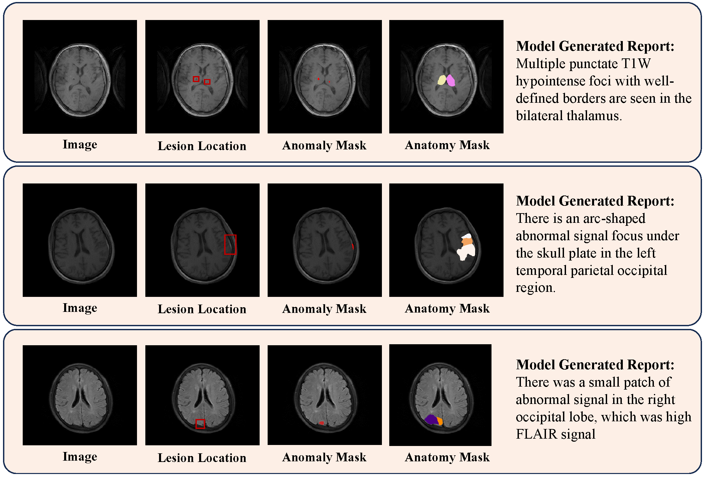
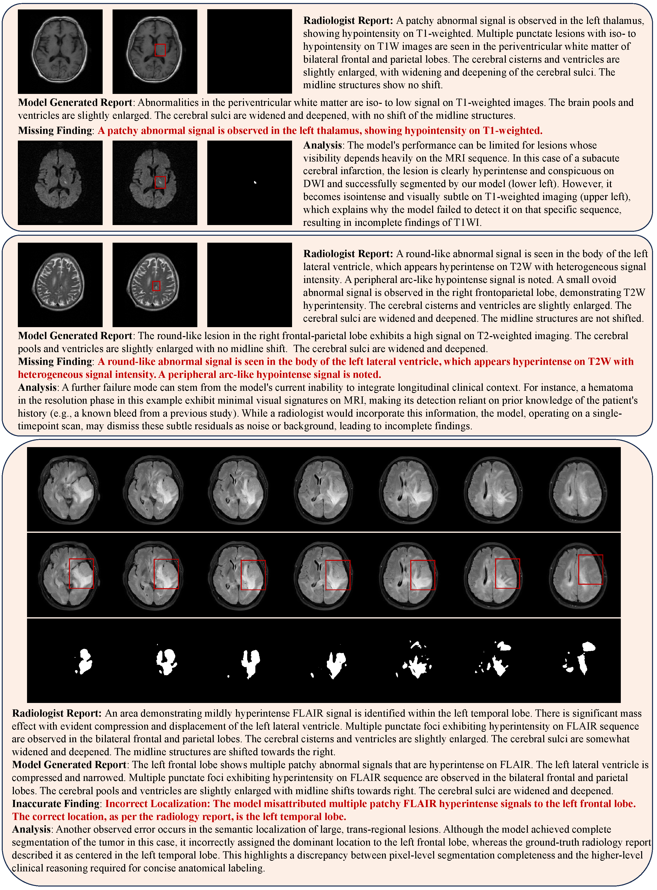

<!-- <h1> RaTEScore</h1> -->
<h1> AutoRG-Brain</h1>

Supplementary material for "Interpretable Brain MRI Report Generation Anchored by Lesion Topography" published in IEEE Journal of Biomedical and Health Informatics (J-BHI).

## Discussion 

1. **Effectiveness of Key Method Components.** Results demonstrate that region-based report generation outperforms global methods, primarily due to:
(i) capturing fine-grained details to avoid lesion-report mismatches;
(ii) focusing attention on relevant regions via segmentation masks;
(iii) enabling enhancement through radiologist prompting or segmentation refinements; and
(iv) maintaining robustness to scale disparities (e.g., small lesions in large anatomical masks) through training on diverse pathologies and explicit region-grounded supervision, ensuring effective feature extraction for subtle abnormalities (qualitatively validated in Figure below).
Additionally, our approach leverages partially labeled data via synthetic supervision, with RadGenome-Brain MRI integration during pretraining further boosting performance.

1. **Clinical Impact.** Results demonstrate AI-assisted junior radiologists produce higher-quality reports, attributed to: (i) Reduction of false negatives through automatic abnormal region segmentation, preventing critical findings from being missed. (ii) Comprehensive reports with detailed information, including characteristics such as signal, shape, location, deformation, displacement, and other relevant features of identified regions. 
These findings highlight AI's potential to enhance radiology workflows through grounded rationales and human-AI collaboration, advancing trustworthy clinical assistive systems.

1. **Limitations and Failure Case.** Our framework’s performance is inherently influenced by the accuracy of the segmentation module, as errors in this initial stage can propagate to the report generation phase. Through systematic failure analysis, we identified four primary error patterns that illustrate both the challenges and the practical boundaries of current cross-sectional AI systems: (i) Sequence-Dependent Lesion Visibility: Lesions such as subacute cerebral infarctions may be highly conspicuous on diffusion-weighted imaging (DWI) but nearly isointense on T1-weighted MRI. When missed on a particular sequence, the system may omit findings for that modality, resulting in incomplete multi-sequence reporting; (ii) Lack of Longitudinal Clinical Context: Subtle residual abnormalities—e.g., resolving hematomas with minimal signal—can be misinterpreted as noise when prior imaging or clinical history is unavailable. Radiologists typically rely on longitudinal comparison for such cases, a capability our single-timepoint model does not possess; (iii) Trans-Regional Localization Ambiguity: Large lesions spanning multiple anatomical regions (e.g., temporal–frontal tumors) are often segmented accurately but may be assigned an imprecise anatomical label in the textual report due to ambiguity in defining the “primary” region—a known challenge even in human reporting; (iv) Misattribution of Anatomically Adjacent Structures: Despite correct pixel-level segmentation, fine-grained spatial reasoning remains difficult: lesions in regions like the basal ganglia may occasionally be mislabeled as involving neighboring structures such as the cingulate gyrus or frontal lobe, reflecting limitations in boundary disambiguation. These failure modes are visualized in figure below and highlight important directions for improvement. 
